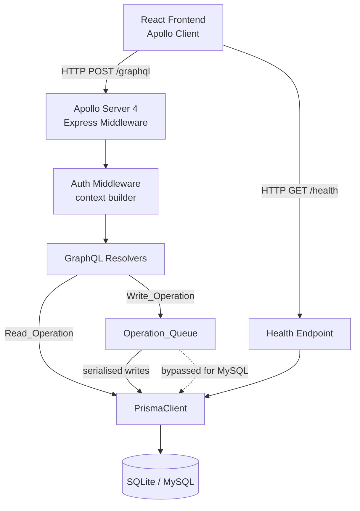
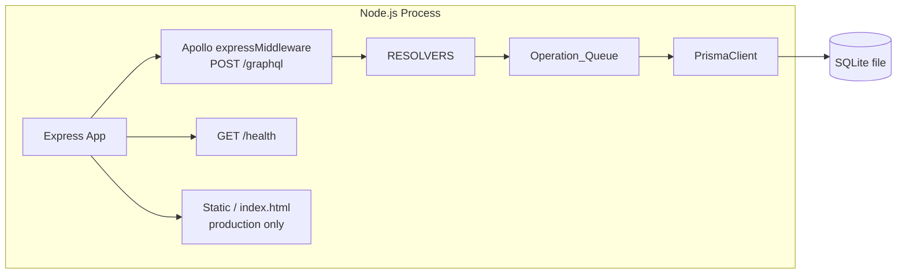
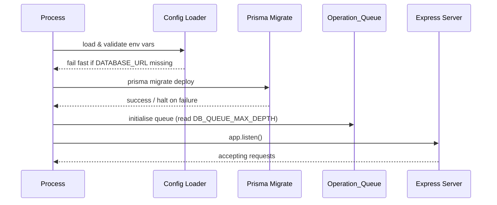

# Design Document: Data Storage & APIs

## Overview

This document describes the technical design for the Data Storage & APIs layer of the D&D companion site. This layer is the foundation that all other features depend on: it owns database schema management, data access, and the public API surface through which the React frontend reads and writes application data.

The design centres on three collaborating pieces:

1. **GraphQL API** — a single `/graphql` endpoint (Apollo Server 4 + Express) that is the exclusive data interface for the frontend.
2. **Prisma ORM** — owns the schema (`schema.prisma`), generates the fully typed `PrismaClient`, and manages versioned migrations.
3. **Operation_Queue** — a serialised in-process FIFO queue that prevents SQLite write-contention under concurrent GraphQL load; bypassed transparently when MySQL is the active provider.

The default database is **SQLite in Rollback Journal Mode** — zero infrastructure, runs locally with a single `DATABASE_URL` env var. The schema and queue are authored so that switching to MySQL requires only a `DATABASE_URL` change and a one-line provider update in `schema.prisma`.

---

## Architecture

### High-Level Request Flow



### Server Process Boundary

The backend runs as a separate Node.js process from the Vite dev server. In development both run concurrently; in production the compiled backend serves the bundled React app as static files as well as the GraphQL endpoint.



### Startup Sequence



---

## Components and Interfaces

### 1. Express Application (`server/app.ts`)

Bootstraps the HTTP server, mounts Apollo middleware and the health endpoint. Handles graceful shutdown — drains the Operation_Queue before closing the PrismaClient connection.

```typescript
// Responsibilities:
// - load config, fail fast on missing DATABASE_URL
// - run prisma migrate deploy
// - apply SQLite PRAGMAs via $executeRawUnsafe on each connection open
// - create PrismaClient singleton
// - create OperationQueue singleton
// - build Apollo Server + expressMiddleware
// - mount /graphql and /health routes
// - register SIGTERM / SIGINT shutdown handler
```

### 2. Prisma Client Singleton (`server/db/prisma.ts`)

A single `PrismaClient` instance shared across the process. On SQLite, a `$connect` event hook runs `PRAGMA foreign_keys = ON` and `PRAGMA synchronous = FULL` immediately after the connection is established.

```typescript
import { PrismaClient } from '@prisma/client';

const prisma = new PrismaClient({
  log: ['error', 'warn'],
});

// Apply required SQLite PRAGMAs on every connection.
// This is a no-op when the active provider is MySQL
// because MySQL ignores PRAGMA statements.
if (process.env.DATABASE_URL?.startsWith('file:')) {
  prisma.$connect().then(() =>
    prisma.$executeRawUnsafe('PRAGMA foreign_keys = ON')
      .then(() => prisma.$executeRawUnsafe('PRAGMA synchronous = FULL'))
  );
}

export default prisma;
```

> **Design note**: Prisma does not currently expose a `beforeQuery` connection hook for SQLite that runs automatically per connection. The approach above runs the PRAGMAs once after `$connect()`. For a single-connection SQLite setup (which is the norm for a serialised write queue), this is sufficient. If a multi-connection pool is ever used, the PRAGMAs must be applied in the Prisma `datasource` `url` query parameters (`?pragma_foreign_keys=ON`) or via a connection-init hook in a custom driver adapter.

### 3. Operation Queue (`server/db/operationQueue.ts`)

A lightweight in-process FIFO queue that wraps any `() => Promise<T>` write callback and ensures it executes only after all previously submitted callbacks have resolved or rejected.

**Interface:**

```typescript
interface OperationQueue {
  /** Enqueue a write callback. Resolves/rejects with the callback's result. */
  enqueue<T>(operation: () => Promise<T>): Promise<T>;

  /** Wait for all queued operations to complete (used during graceful shutdown). */
  drain(): Promise<void>;

  /** Current number of pending operations (for observability). */
  readonly pendingCount: number;
}
```

**Behaviour contract:**
- Maximum depth is configured via `DB_QUEUE_MAX_DEPTH` (default: `100`).
- When depth is exceeded, `enqueue()` rejects immediately with a `QueueFullError` (structured error with `code: 'QUEUE_FULL'`).
- Each operation is timed: queue wait time and execution duration are emitted at `debug` log level.
- A warning log is emitted if wait time exceeds `DB_QUEUE_WARN_MS` (default: `500 ms`).
- When `DATABASE_URL` is a MySQL connection string (does not start with `file:`), the queue module exports a **passthrough** implementation where `enqueue(fn)` simply calls `fn()` directly.

**Implementation sketch:**

```typescript
class SerialOperationQueue implements OperationQueue {
  private tail: Promise<void> = Promise.resolve();
  private _pendingCount = 0;

  enqueue<T>(operation: () => Promise<T>): Promise<T> {
    if (this._pendingCount >= maxDepth) {
      return Promise.reject(new QueueFullError());
    }
    this._pendingCount++;
    const result = this.tail.then(async () => {
      const waitMs = Date.now() - enqueuedAt;
      // log wait time, warn if > DB_QUEUE_WARN_MS
      const start = Date.now();
      try {
        return await operation();
      } finally {
        // log execution duration
        this._pendingCount--;
      }
    });
    this.tail = result.then(() => {}, () => {});
    return result;
  }

  drain(): Promise<void> { return this.tail; }
}
```

### 4. GraphQL Schema (`server/graphql/schema/`)

Type definitions (SDL) live in `.graphql` files, one per domain module. Resolvers are co-located in a `resolvers/` directory. The final schema is assembled with `makeExecutableSchema` from `@graphql-tools/schema`.

```
server/
  graphql/
    schema/
      index.ts          # assembles typeDefs + resolvers
      user.graphql
      character.graphql
      campaign.graphql
      session.graphql
      encounter.graphql
      combatant.graphql
      statBlock.graphql
      item.graphql
    resolvers/
      user.resolver.ts
      character.resolver.ts
      ...
    context.ts          # builds GraphQL context (auth, prisma, queue)
```

**GraphQL context type:**

```typescript
interface GraphQLContext {
  prisma: PrismaClient;
  queue: OperationQueue;
  currentUser: AuthUser | null; // null = unauthenticated
}
```

### 5. Data-Access Service Layer (`server/services/`)

Resolvers do not call PrismaClient or the queue directly. Instead they call service functions. Service functions own:
- transaction boundaries (`prisma.$transaction()`)
- routing writes through the queue
- mapping Prisma errors to domain errors

```typescript
// Example: characterService.ts
export async function createCharacter(
  input: CreateCharacterInput,
  ctx: GraphQLContext
): Promise<Character> {
  return ctx.queue.enqueue(() =>
    ctx.prisma.$transaction(async (tx) => {
      // multi-model write — character + default inventory
      const character = await tx.character.create({ data: input });
      await tx.inventory.create({ data: { characterId: character.id } });
      return character;
    })
  );
}
```

### 6. Error Handling (`server/errors/`)

A dedicated error-mapping module converts Prisma errors to structured `GraphQLError` instances with `extensions.code`.

```typescript
// PrismaClientKnownRequestError code → domain code mapping
const PRISMA_ERROR_MAP: Record<string, string> = {
  P2000: 'VALIDATION_ERROR',
  P2001: 'NOT_FOUND',
  P2002: 'CONFLICT',          // unique constraint
  P2003: 'FOREIGN_KEY_VIOLATION',
  P2025: 'NOT_FOUND',
};
```

`PrismaClientUnknownRequestError` and `PrismaClientRustPanicError` are caught, logged with full detail internally, and surfaced as `INTERNAL_SERVER_ERROR` with no Prisma-specific content in the response.

### 7. Health Endpoint (`GET /health`)

Returns `200 OK` when the database is reachable, `503 Service Unavailable` otherwise.

```typescript
// Response shape
interface HealthResponse {
  status: 'ok' | 'degraded';
  database: 'connected' | 'unreachable';
  timestamp: string; // ISO 8601
}
```

The health check executes `prisma.$queryRaw\`SELECT 1\`` with a short timeout. It does not go through the Operation_Queue.

---

## Data Models

### Prisma Schema Structure

The `schema.prisma` file uses environment variables for both provider and connection URL so that no code change is required to switch providers:

```prisma
generator client {
  provider = "prisma-client-js"
}

datasource db {
  provider = env("DATABASE_PROVIDER")   // "sqlite" or "mysql"
  url      = env("DATABASE_URL")
}
```

`DATABASE_PROVIDER` defaults to `"sqlite"` in `.env` and `.env.example`. When `DATABASE_URL` is a MySQL connection string, `DATABASE_PROVIDER` is set to `"mysql"` in the corresponding env file.

### Domain Models (Initial Schema)

These represent the initial set of domain entities required by the requirements. Each model is designed to be compatible with both SQLite and MySQL Prisma providers (no SQLite-only or MySQL-only field types are used).

```prisma
model User {
  id           String      @id @default(cuid())
  email        String      @unique
  passwordHash String
  displayName  String
  theme        String      @default("dark")
  createdAt    DateTime    @default(now())
  updatedAt    DateTime    @updatedAt
  characters   Character[]
  campaigns    Campaign[]  @relation("CampaignOwner")
}

model Character {
  id         String    @id @default(cuid())
  name       String
  classType  String
  level      Int       @default(1)
  maxHp      Int
  currentHp  Int
  userId     String
  user       User      @relation(fields: [userId], references: [id])
  combatants Combatant[]
  inventory  Inventory?
  createdAt  DateTime  @default(now())
  updatedAt  DateTime  @updatedAt
}

model Campaign {
  id        String     @id @default(cuid())
  name      String
  ownerId   String
  owner     User       @relation("CampaignOwner", fields: [ownerId], references: [id])
  sessions  Session[]
  createdAt DateTime   @default(now())
  updatedAt DateTime   @updatedAt
}

model Session {
  id         String      @id @default(cuid())
  campaignId String
  campaign   Campaign    @relation(fields: [campaignId], references: [id])
  name       String
  date       DateTime
  notes      String?
  encounters Encounter[]
  createdAt  DateTime    @default(now())
  updatedAt  DateTime    @updatedAt
}

model Encounter {
  id         String      @id @default(cuid())
  sessionId  String
  session    Session     @relation(fields: [sessionId], references: [id])
  name       String
  round      Int         @default(1)
  active     Boolean     @default(false)
  combatants Combatant[]
  createdAt  DateTime    @default(now())
  updatedAt  DateTime    @updatedAt
}

model Combatant {
  id          String    @id @default(cuid())
  encounterId String
  encounter   Encounter @relation(fields: [encounterId], references: [id])
  name        String
  initiative  Int       @default(0)
  maxHp       Int
  currentHp   Int
  type        String    // "player" | "monster" | "npc"
  characterId String?
  character   Character? @relation(fields: [characterId], references: [id])
  statBlockId String?
  statBlock   StatBlock? @relation(fields: [statBlockId], references: [id])
  createdAt   DateTime  @default(now())
  updatedAt   DateTime  @updatedAt
}

model StatBlock {
  id           String      @id @default(cuid())
  name         String
  size         String
  type         String
  alignment    String
  armorClass   Int
  hitPoints    Int
  speed        String
  strength     Int
  dexterity    Int
  constitution Int
  intelligence Int
  wisdom       Int
  charisma     Int
  cr           String
  source       String?     // e.g., "D&D Beyond"
  sourcePath   String?     // e.g., "/monsters/goblin" for D&D Beyond linking
  combatants   Combatant[]
  createdAt    DateTime    @default(now())
  updatedAt    DateTime    @updatedAt
}

model Inventory {
  id          String      @id @default(cuid())
  characterId String      @unique
  character   Character   @relation(fields: [characterId], references: [id])
  items       ItemSlot[]
  createdAt   DateTime    @default(now())
  updatedAt   DateTime    @updatedAt
}

model Item {
  id          String     @id @default(cuid())
  name        String
  rarity      String
  description String
  type        String     // "magic" | "consumable" | "equipment"
  slots       ItemSlot[]
  createdAt   DateTime   @default(now())
  updatedAt   DateTime   @updatedAt
}

model ItemSlot {
  id          String    @id @default(cuid())
  inventoryId String
  inventory   Inventory @relation(fields: [inventoryId], references: [id])
  itemId      String
  item        Item      @relation(fields: [itemId], references: [id])
  quantity    Int       @default(1)
  equipped    Boolean   @default(false)
  createdAt   DateTime  @default(now())
  updatedAt   DateTime  @updatedAt
}
```

### Provider Compatibility Notes

| Concern | SQLite | MySQL | Mitigation |
|---|---|---|---|
| `cuid()` IDs | ✅ | ✅ | Standard Prisma default |
| `DateTime` storage | Numeric | DATETIME | Prisma handles mapping |
| `String` as enum | ✅ | ✅ | No native enum used (String field) |
| Foreign keys | Opt-in (PRAGMA) | Default on | PRAGMA applied at connect |
| JSON fields | Not used initially | Native | Avoided in initial schema |
| Decimal precision | Limited | Full | Using `Int`/`String` where precision matters |

---

## Correctness Properties

*A property is a characteristic or behavior that should hold true across all valid executions of a system — essentially, a formal statement about what the system should do. Properties serve as the bridge between human-readable specifications and machine-verifiable correctness guarantees.*

The property-based testing library for this project is **[fast-check](https://fast-check.dev/)**, which integrates directly with Vitest.

### Property 1: All GraphQL errors contain an extensions.code field

*For any* error condition that occurs during a GraphQL resolver execution (Prisma known error, unknown error, validation error, or authentication error), the GraphQL response body should always contain an `extensions.code` field on every error object, and should never contain Prisma-internal details such as error model names, raw SQL, or Prisma error codes.

**Validates: Requirements 1.6, 7.1, 7.3**

### Property 2: Protected resolvers reject unauthenticated requests

*For any* query or mutation that accesses user-specific or campaign-specific data, submitting the request without a valid authentication token should always result in a GraphQL error with `extensions.code === 'UNAUTHENTICATED'`, regardless of the query structure or variables.

**Validates: Requirements 1.7**

### Property 3: Operation_Queue serialises writes in FIFO order under SQLite

*For any* sequence of concurrent write operations submitted to the Operation_Queue when using the SQLite provider, the operations should execute serially (never overlapping) and complete in first-in-first-out order, such that no two write callbacks are active simultaneously.

**Validates: Requirements 4.1**

### Property 4: Operation_Queue rejects operations when at capacity

*For any* write operation submitted to the Operation_Queue when the current pending count equals `DB_QUEUE_MAX_DEPTH`, the `enqueue()` call should immediately reject with a structured `QueueFullError` (containing `code: 'QUEUE_FULL'`) rather than silently dropping the operation or blocking indefinitely.

**Validates: Requirements 4.3, 4.4**

### Property 5: Transaction atomicity — partial failures produce no partial writes

*For any* multi-model write operation executed inside `prisma.$transaction()`, if any single operation within the transaction throws an error, querying the database afterward should show that none of the operations from that transaction were persisted — the database state before and after a failed transaction should be identical.

**Validates: Requirements 2.8, 6.1, 6.2, 6.3**

### Property 6: Graceful shutdown drains all queued writes

*For any* set of write operations enqueued in the Operation_Queue at the time a graceful shutdown signal is received, all previously enqueued operations should resolve or reject before the PrismaClient connection is closed — no queued operation should be abandoned mid-execution.

**Validates: Requirements 4.7**

---

## Error Handling

### Error Classification and Mapping

All errors are caught at the service layer before reaching resolvers. The error pipeline is:

```
PrismaError
  → mapPrismaError()         // converts to AppError with domain code
  → GraphQL formatError()    // formats AppError as GraphQL error extension
  → client response          // { errors: [{ message, extensions: { code } }] }
```

**Prisma known error codes → domain codes:**

| Prisma Code | Domain Code | HTTP analogue |
|---|---|---|
| P2001, P2025 | `NOT_FOUND` | 404 |
| P2002 | `CONFLICT` | 409 |
| P2003 | `FOREIGN_KEY_VIOLATION` | 409 |
| P2000, P2007 | `VALIDATION_ERROR` | 400 |
| P1001 | `DATABASE_UNAVAILABLE` | 503 |

**Unknown/panic errors** are logged at `error` level with full stack trace, operation name, and entity ID. The client receives only `{ code: 'INTERNAL_SERVER_ERROR', message: 'An unexpected error occurred.' }`.

### Queue Error Handling

| Condition | Error Code | Logged? |
|---|---|---|
| Queue at capacity | `QUEUE_FULL` | Warning |
| Operation throws | passes through to caller | Yes (via service layer) |
| Shutdown drain timeout | `DRAIN_TIMEOUT` | Error |

### Startup Error Handling

| Condition | Behaviour |
|---|---|
| `DATABASE_URL` not set | Process exits with code 1, clear message |
| `prisma migrate deploy` fails | Logs migration name + error, process exits with code 1 |
| Database unreachable at start | Health check fails; process continues but logs error |

---

## Testing Strategy

### Dual Testing Approach

Unit tests cover specific examples, edge cases, and error conditions. Property-based tests validate universal invariants using **fast-check** integrated with Vitest.

### Unit Tests

Unit tests are co-located with source files (e.g., `operationQueue.test.ts` next to `operationQueue.ts`). They focus on:

- **OperationQueue**: serialisation order, queue-full rejection, drain behaviour, passthrough mode for MySQL.
- **Error mapping**: every Prisma error code maps to the expected domain code; unknown errors return `INTERNAL_SERVER_ERROR`.
- **Config loader**: fail-fast on missing `DATABASE_URL`; correct defaults for optional env vars.
- **Startup hooks**: `prisma migrate deploy` is called before the server accepts requests; failure halts startup.
- **Resolvers**: each resolver calls the correct service function and propagates errors correctly (using mocked service layer).

SQLite in-memory mode (`DATABASE_URL=file::memory:?cache=shared`) is used for all integration-touching unit tests. Migrations are applied via `prisma migrate deploy` at test suite startup via a global setup file.

### Property-Based Tests (fast-check + Vitest)

Each property listed in the Correctness Properties section maps to exactly one property-based test. Minimum 100 iterations per test (fast-check default).

**Tag format used in each test:**

```typescript
// Feature: data-storage-api, Property N: <property text>
```

**Property 1 — Error extensions.code:**
Generate arbitrary Prisma error instances (varying error codes, messages). Feed them through `mapPrismaError()` and `formatError()`. Assert every resulting GraphQL error object has a non-empty `extensions.code` string with no Prisma-internal content.

**Property 2 — Auth rejection:**
Generate arbitrary GraphQL operation strings and variable maps. Execute them against the Apollo schema with no auth context. Assert the response always contains at least one error with `extensions.code === 'UNAUTHENTICATED'`.

**Property 3 — Queue serialisation order:**
Generate an arbitrary array of N async operations (2–20). Submit all concurrently to the OperationQueue. Record execution start/end timestamps. Assert no two operations overlap (start₂ ≥ end₁) and order matches submission order.

**Property 4 — Queue-full rejection:**
Generate an arbitrary `DB_QUEUE_MAX_DEPTH` (1–50). Fill the queue to capacity with never-resolving stubs. Submit one more operation. Assert immediate rejection with `code === 'QUEUE_FULL'`.

**Property 5 — Transaction atomicity:**
Generate arbitrary pairs of valid + intentionally-failing Prisma operations. Execute them in a `$transaction()`. Assert that after the failed transaction, a subsequent read of all affected tables returns the same count as before the transaction.

**Property 6 — Graceful drain:**
Generate an arbitrary batch of N write operations. Start draining, trigger shutdown signal. Assert all N operations complete (resolve or reject) before the PrismaClient `$disconnect()` call is made.

### Integration Tests

The `/health` endpoint and the end-to-end GraphQL request path are tested as integration tests using a real in-memory SQLite database:

- `GET /health` returns `200 { status: 'ok', database: 'connected' }` when the DB is reachable.
- `GET /health` returns `503 { status: 'degraded', database: 'unreachable' }` when the DB is not reachable.
- A full GraphQL query round-trip (create character → query character) persists and returns correct data.

### Test Environment Configuration

```
DATABASE_URL=file::memory:?cache=shared
NODE_ENV=test
DB_QUEUE_MAX_DEPTH=10
DB_QUEUE_WARN_MS=100
```

Migrations are applied in a global Vitest setup file. The PrismaClient is reset between test suites using `prisma.$transaction([prisma.itemSlot.deleteMany(), ... ])` to clear all tables in dependency order.
