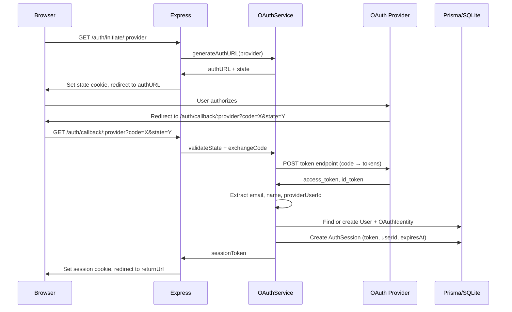
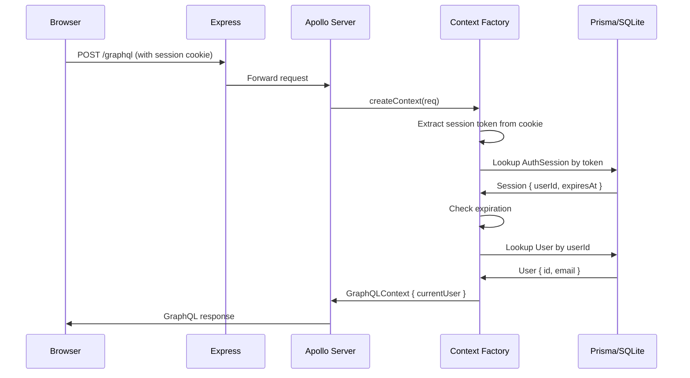

# Design Document: OAuth Migration

## Overview

This design describes the migration from email/password authentication to an OAuth-only authentication model. The current system uses bcrypt password hashing, JWT tokens stored in localStorage, and email/password forms. The target system uses OAuth 2.0 authorization code flow with six providers (Google, Discord, GitHub, Facebook, Apple, Microsoft), server-side session tokens stored in Prisma, and secure HTTP-only cookies.

The migration affects every layer of the stack:
- **Database**: New `OAuthIdentity` model, new `AuthSession` model, removal of `passwordHash` field
- **Server**: New OAuth service using the `arctic` library, Express callback route, cookie-based session management
- **GraphQL**: New auth mutations/queries, removal of password-based operations
- **Frontend**: OAuth button login page, cookie-based AuthContext, removal of RegisterPage

### Key Design Decisions

| Decision | Choice | Rationale |
|----------|--------|-----------|
| OAuth library | `arctic` | Lightweight, fully-typed, runtime-agnostic, supports all 6 providers natively |
| Session storage | Prisma `AuthSession` model | Consistent with existing data layer, survives server restarts, queryable for admin |
| Session token format | 32-byte random hex string | 256 bits of entropy, URL-safe, simple to generate with `crypto.randomBytes` |
| Cookie transport | Secure, HttpOnly, SameSite=Lax | Prevents XSS token theft, allows OAuth redirects, standard security posture |
| CSRF protection | `state` parameter in OAuth flow + cookie validation | Standard OAuth 2.0 CSRF mitigation per RFC 6749 |
| PKCE | Used for Google (required), available for others | Additional security for authorization code interception |

## Architecture



### Request Authentication Flow (Post-Login)



## Components and Interfaces

### 1. OAuth Service (`server/services/oauthService.ts`)

The central service handling OAuth provider interactions, user resolution, and session management.

```typescript
// Provider configuration loaded from environment variables
interface OAuthProviderConfig {
  clientId: string;
  clientSecret: string;
  redirectUri: string;
}

// Result of extracting user info from OAuth tokens
interface OAuthProfile {
  email: string;
  name: string | null;
  providerUserId: string;
  provider: string;
}

// Service dependencies (same pattern as existing services)
interface OAuthServiceDeps {
  prisma: PrismaClient;
  queue: OperationQueue;
}

// Public API
function getProviderConfig(provider: string): OAuthProviderConfig;
function createAuthorizationURL(provider: string): { url: string; state: string; codeVerifier?: string };
function exchangeCode(provider: string, code: string, codeVerifier?: string): Promise<OAuthProfile>;
function resolveOrCreateUser(deps: OAuthServiceDeps, profile: OAuthProfile): Promise<User>;
function createSession(deps: OAuthServiceDeps, userId: string): Promise<string>;
function validateSession(deps: OAuthServiceDeps, token: string): Promise<AuthUser | null>;
function invalidateSession(deps: OAuthServiceDeps, token: string): Promise<void>;
```

### 2. OAuth Provider Registry (`server/services/oauthProviders.ts`)

Initializes `arctic` provider instances from environment variables.

```typescript
import * as arctic from "arctic";

// Each provider is lazily initialized from env vars
// Supported providers: google, discord, github, facebook, apple, microsoft
function getProvider(name: string): arctic.Google | arctic.Discord | arctic.GitHub | ...;

// Scopes per provider
const PROVIDER_SCOPES: Record<string, string[]> = {
  google: ["openid", "profile", "email"],
  discord: ["identify", "email"],
  github: ["user:email"],
  facebook: ["email", "public_profile"],
  apple: ["name", "email"],
  microsoft: ["openid", "profile", "email"],
};
```

### 3. Callback Handler (`server/routes/authRoutes.ts`)

Express router handling OAuth initiation and callback.

```typescript
import { Router } from "express";

const authRouter = Router();

// Initiate OAuth flow - sets state cookie, redirects to provider
authRouter.get("/auth/initiate/:provider", (req, res) => { ... });

// Handle OAuth callback - exchanges code, creates session, sets cookie
authRouter.get("/auth/callback/:provider", (req, res) => { ... });

export { authRouter };
```

### 4. Session Cookie Utilities (`server/services/sessionCookie.ts`)

Helper functions for cookie management.

```typescript
const SESSION_COOKIE_NAME = "session";
const SESSION_MAX_AGE_SECONDS = 7 * 24 * 60 * 60; // 7 days

interface CookieOptions {
  httpOnly: true;
  secure: boolean; // true in production
  sameSite: "lax";
  path: "/";
  maxAge: number;
}

function setSessionCookie(res: Response, token: string): void;
function clearSessionCookie(res: Response): void;
function getSessionToken(req: Request): string | null;
```

### 5. Updated GraphQL Context Factory (`server/graphql/context.ts`)

Replaces JWT-based auth with cookie-session lookup.

```typescript
export function createContextFactory(deps: CreateContextDeps) {
  return async ({ req }: { req: IncomingMessage }): Promise<GraphQLContext> => {
    // Parse session cookie from request
    const sessionToken = getSessionToken(req);
    const currentUser = sessionToken
      ? await validateSession(deps, sessionToken)
      : null;

    return { prisma: deps.prisma, queue: deps.queue, currentUser };
  };
}
```

### 6. Updated Auth Resolvers (`server/graphql/resolvers/auth.resolver.ts`)

New resolvers for OAuth-based operations.

```typescript
export const authResolvers = {
  Query: {
    me: (_parent, _args, ctx) => ctx.currentUser ? lookupUser(ctx) : null,
    initiateOAuth: (_parent, { provider }, ctx) => getAuthorizationURL(provider),
    linkedProviders: (_parent, _args, ctx) => getLinkedProviders(ctx),
  },
  Mutation: {
    logout: async (_parent, _args, ctx) => invalidateCurrentSession(ctx),
  },
};
```

### 7. Frontend AuthContext (`src/contexts/AuthContext.tsx`)

Cookie-based auth state management.

```typescript
interface AuthContextType {
  user: User | null;
  isLoading: boolean;
  initiateOAuth: (provider: string) => void;
  logout: () => Promise<void>;
}

// Auth state determined by `me` query with credentials: "include"
// No localStorage, no token state
// initiateOAuth redirects to /auth/initiate/:provider
// logout calls GraphQL mutation then clears local state
```

### 8. Frontend LoginPage (`src/pages/LoginPage.tsx`)

OAuth-only login interface.

```typescript
// Displays provider buttons: Google, Discord, GitHub, Facebook, Apple, Microsoft
// Each button calls initiateOAuth(providerName)
// Shows loading state during redirect
// Reads ?error query param to display OAuth failure messages
// No email/password fields, no register link
```

## Data Models

### Prisma Schema Changes

```prisma
// ─── Users (updated) ─────────────────────────────────────────────────────────

model User {
  id        String   @id @default(cuid())
  email     String   @unique
  // passwordHash REMOVED
  name      String?
  themeMode String   @default("SYSTEM")
  createdAt DateTime @default(now())
  updatedAt DateTime @updatedAt

  // Relations
  characters     Character[]
  campaigns      Campaign[]
  sessions       Session[]
  oauthIdentities OAuthIdentity[]
  authSessions   AuthSession[]

  @@index([email])
}

// ─── OAuth Identities ────────────────────────────────────────────────────────

model OAuthIdentity {
  id             String   @id @default(cuid())
  provider       String   // "google" | "discord" | "github" | "facebook" | "apple" | "microsoft"
  providerUserId String
  userId         String
  user           User     @relation(fields: [userId], references: [id], onDelete: Cascade)
  createdAt      DateTime @default(now())

  @@unique([provider, providerUserId])
  @@index([userId])
}

// ─── Auth Sessions ───────────────────────────────────────────────────────────

model AuthSession {
  id        String   @id @default(cuid())
  token     String   @unique
  userId    String
  user      User     @relation(fields: [userId], references: [id], onDelete: Cascade)
  expiresAt DateTime
  createdAt DateTime @default(now())

  @@index([token])
  @@index([userId])
}
```

### GraphQL Schema Changes

**Remove** `auth.graphql`:
```graphql
# REMOVED:
# type AuthPayload { token: String!, user: User! }
# register(email: String!, password: String!, name: String): AuthPayload!
# login(email: String!, password: String!): AuthPayload!
# changePassword(currentPassword: String!, newPassword: String!): Boolean!
```

**New** `auth.graphql`:
```graphql
type OAuthURL {
  url: String!
  provider: String!
}

extend type Query {
  me: User
  initiateOAuth(provider: String!): OAuthURL!
  linkedProviders: [String!]!
}

extend type Mutation {
  logout: Boolean!
}
```

**Update** `user.graphql` — remove `CreateUserInput.password`:
```graphql
input CreateUserInput {
  email: String!
  name: String
  themeMode: ThemeMode
}
```

### Environment Variables

```bash
# OAuth Provider Credentials
GOOGLE_CLIENT_ID=
GOOGLE_CLIENT_SECRET=
DISCORD_CLIENT_ID=
DISCORD_CLIENT_SECRET=
GITHUB_CLIENT_ID=
GITHUB_CLIENT_SECRET=
FACEBOOK_CLIENT_ID=
FACEBOOK_CLIENT_SECRET=
APPLE_CLIENT_ID=
APPLE_CLIENT_SECRET=
MICROSOFT_CLIENT_ID=
MICROSOFT_CLIENT_SECRET=

# OAuth Configuration
OAUTH_REDIRECT_BASE_URL=http://localhost:5173  # Base URL for callback URIs
SESSION_SECRET=  # Not strictly needed with token-based sessions, but useful for cookie signing

# Existing (keep)
DATABASE_URL=
```

## Correctness Properties

*A property is a characteristic or behavior that should hold true across all valid executions of a system — essentially, a formal statement about what the system should do. Properties serve as the bridge between human-readable specifications and machine-verifiable correctness guarantees.*

### Property 1: Authorization URL generation produces valid provider URLs

*For any* supported OAuth provider name, calling `createAuthorizationURL(provider)` SHALL return a URL that contains the provider's authorization endpoint, the configured client ID, the configured redirect URI, and the required scopes for that provider.

**Validates: Requirements 2.1, 2.2, 9.1**

### Property 2: Profile extraction from valid token responses

*For any* valid token response or userinfo response from a supported OAuth provider, the `exchangeCode` function SHALL extract a non-empty email, a provider-specific user identifier, and optionally a name — producing a complete `OAuthProfile` object.

**Validates: Requirements 2.4**

### Property 3: Provider error propagation

*For any* error response from an OAuth provider (invalid code, network failure, malformed response), the OAuth service SHALL return an authentication error with a descriptive message rather than creating a session or user.

**Validates: Requirements 2.5**

### Property 4: New user creation completeness

*For any* OAuth profile where the email does not match any existing User record, the `resolveOrCreateUser` function SHALL atomically create a User record (with email, name, themeMode="SYSTEM") AND an OAuthIdentity record (with provider, providerUserId, userId), such that querying the user by email returns the created user with the identity linked.

**Validates: Requirements 3.1, 3.2, 3.3**

### Property 5: Existing user identity linking without duplication

*For any* OAuth profile where the email matches an existing User record and no OAuthIdentity with the same provider+providerUserId exists for a different user, the `resolveOrCreateUser` function SHALL link the new OAuthIdentity to the existing user without increasing the total user count.

**Validates: Requirements 3.4**

### Property 6: Duplicate identity rejection

*For any* attempt to create an OAuthIdentity where the (provider, providerUserId) combination is already linked to a different user, the service SHALL return an error indicating the identity is already associated with another account, and no new records shall be created.

**Validates: Requirements 3.5, 4.2**

### Property 7: Cascade deletion of OAuth identities

*For any* User record that has one or more associated OAuthIdentity records, deleting the User SHALL also delete all associated OAuthIdentity records and AuthSession records.

**Validates: Requirements 4.4**

### Property 8: Session token entropy and persistence

*For any* call to `createSession(userId)`, the generated session token SHALL be at least 32 bytes (256 bits) of cryptographic randomness, and after creation the token SHALL be retrievable from the database with the correct userId and a future expiresAt timestamp.

**Validates: Requirements 5.1, 5.2**

### Property 9: Session cookie attributes

*For any* session creation response, the `Set-Cookie` header SHALL specify the session token with `HttpOnly=true`, `Secure=true` (in production), `SameSite=Lax`, `Path=/`, and `Max-Age` equivalent to 7 days.

**Validates: Requirements 5.3**

### Property 10: Session-based user resolution round-trip

*For any* valid (non-expired) session token stored in the database, calling `validateSession(token)` SHALL return the associated user's `{ id, email }`, and a GraphQL request carrying that token in a cookie SHALL have `ctx.currentUser` set to that user.

**Validates: Requirements 5.4, 7.4, 7.5, 9.3**

### Property 11: Session invalidation

*For any* valid session token, after calling `invalidateSession(token)`, subsequent calls to `validateSession(token)` SHALL return null. Additionally, for any session token whose `expiresAt` is in the past, `validateSession(token)` SHALL return null.

**Validates: Requirements 5.5, 5.6, 7.7, 9.2**

### Property 12: CSRF state validation

*For any* OAuth callback request, if the `state` query parameter does not match the state stored in the request's state cookie, the Callback_Handler SHALL reject the request and redirect to the login page with an error, without creating a session.

**Validates: Requirements 10.4**

### Property 13: Callback redirect to stored URL

*For any* completed OAuth callback flow, the final redirect location SHALL be the return URL encoded in the state parameter (defaulting to `/` if none was stored).

**Validates: Requirements 10.5**

## Error Handling

### OAuth Provider Errors

| Scenario | Behavior |
|----------|----------|
| Provider returns `error` param on callback | Redirect to `/login?error=<description>` |
| Token exchange timeout (>10s) | Redirect to `/login?error=provider_timeout` |
| Token exchange returns invalid response | Redirect to `/login?error=provider_error` |
| Provider userinfo endpoint fails | Redirect to `/login?error=profile_fetch_failed` |
| Unsupported provider name | GraphQL error with code `BAD_USER_INPUT` |

### Session Errors

| Scenario | Behavior |
|----------|----------|
| Missing session cookie | `ctx.currentUser = null` (unauthenticated) |
| Expired session token | Clear cookie, `ctx.currentUser = null` |
| Session token not found in DB | Clear cookie, `ctx.currentUser = null` |
| Database error during session lookup | Log error, `ctx.currentUser = null` |

### Account Resolution Errors

| Scenario | Behavior |
|----------|----------|
| OAuth identity already linked to different user | Redirect to `/login?error=identity_conflict` |
| Database write failure during user creation | Redirect to `/login?error=account_creation_failed` |
| Missing email in OAuth profile | Redirect to `/login?error=email_required` |

### Frontend Error Display

The LoginPage reads the `error` query parameter and maps it to user-friendly messages:

```typescript
const ERROR_MESSAGES: Record<string, string> = {
  provider_timeout: "The authentication provider took too long to respond. Please try again.",
  provider_error: "There was a problem communicating with the authentication provider.",
  profile_fetch_failed: "Could not retrieve your profile. Please try again.",
  identity_conflict: "This account is already linked to a different user.",
  account_creation_failed: "Could not create your account. Please try again.",
  email_required: "Your OAuth provider did not share an email address, which is required.",
  access_denied: "You denied the authentication request.",
  invalid_state: "The authentication request was invalid. Please try again.",
};
```

## Testing Strategy

### Property-Based Tests (Vitest + fast-check)

Property-based testing applies well to this feature because the OAuth service has pure logic for URL generation, profile extraction, session management, and user resolution that varies meaningfully with different inputs (provider names, profile data, token values).

**Library**: `fast-check` (already in devDependencies)
**Minimum iterations**: 100 per property test
**Tag format**: `Feature: oauth-migration, Property {N}: {title}`

Target properties for PBT:
- Properties 1, 2, 3: OAuth URL generation and profile extraction (mock provider responses)
- Properties 4, 5, 6: User resolution logic (generate random profiles, existing users)
- Properties 8, 10, 11: Session token lifecycle (generate tokens, test round-trip)
- Property 12: CSRF state validation (generate random state strings)

### Unit Tests (Vitest)

- Auth resolver returns correct errors for unsupported providers
- Cookie utility functions set correct attributes
- LoginPage renders all 6 provider buttons
- LoginPage displays error messages from query params
- AuthContext calls `me` query with `credentials: "include"`
- `/register` route redirects to `/login`

### Integration Tests (Vitest + Supertest)

- Full OAuth callback flow with mocked provider (code exchange → session creation → cookie set → redirect)
- GraphQL `me` query with valid session cookie returns user
- GraphQL `me` query without cookie returns null
- GraphQL `logout` mutation invalidates session and clears cookie
- Expired session token is rejected and cookie cleared

### What Is NOT Covered by PBT

- Actual OAuth provider network calls (integration tests with mocks)
- UI rendering of provider buttons (component unit tests)
- Cookie behavior in real browsers (manual/E2E testing)
- Prisma migration correctness (migration is verified by `prisma migrate deploy`)
